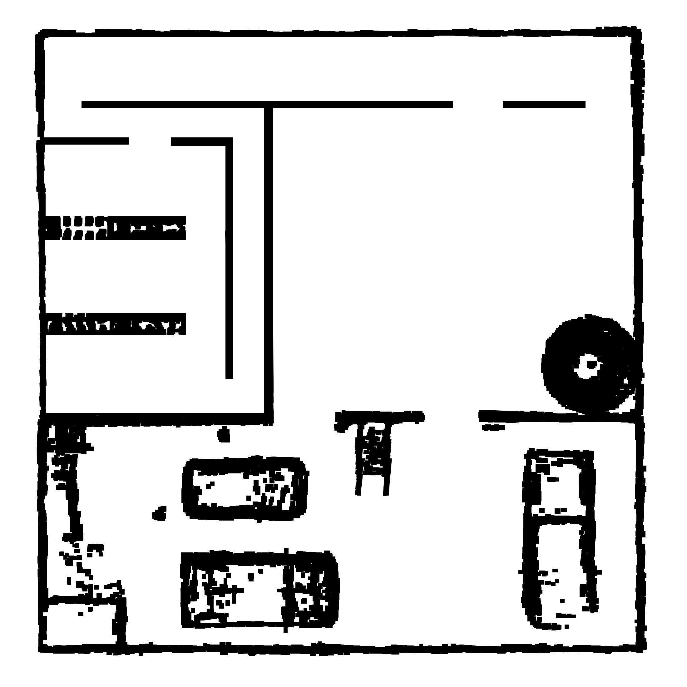
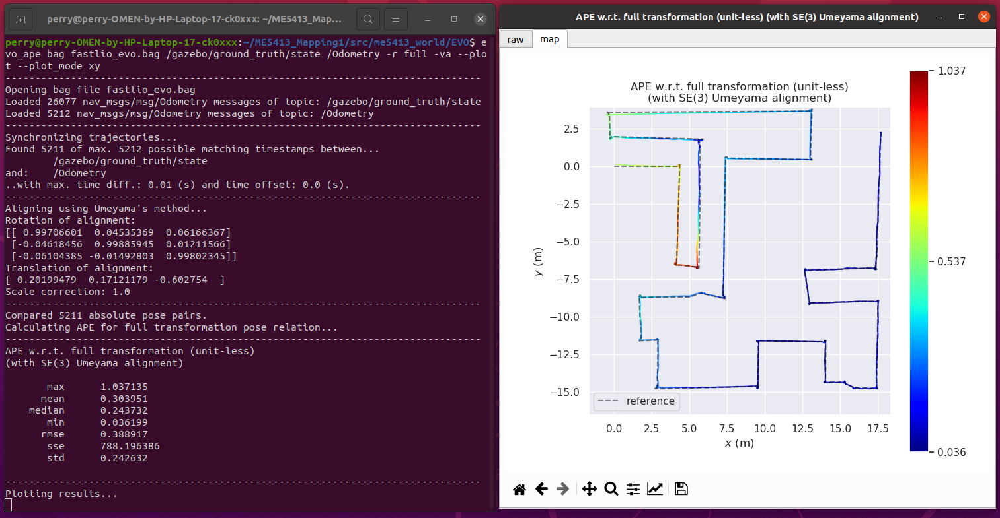
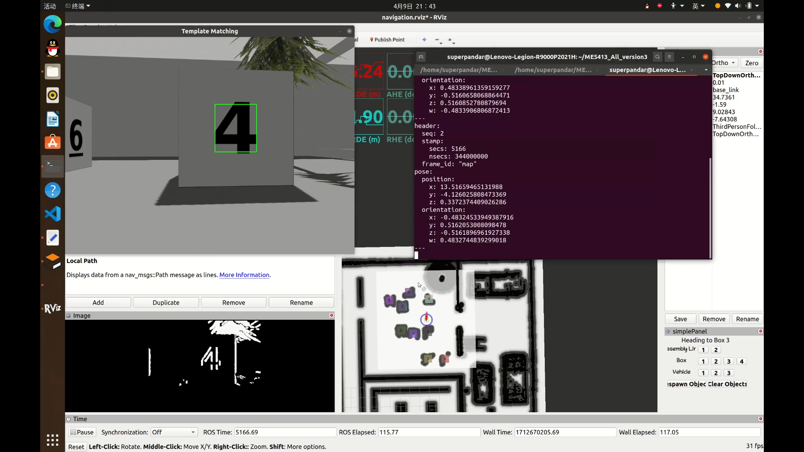

# ME5413_Final_Project

NUS ME5413 Autonomous Mobile Robotics Final Project
> Authors: [Jiang Qi](https://github.com/QIAND123456789), [Lu Zixuan](https://github.com/Pandarlu), [Wang Pengyu](https://github.com/PerryWang0821), Shen Xuanru, [Wei Ruijie](https://github.com/Maxwell-00) and [Ye Zhengtao](https://github.com/LeeeYuYu) (Sorting is based on alphabetical order only)


## Dependencies

* System Requirements:
  * Ubuntu 20.04 (18.04 not yet tested)
  * ROS Noetic (Melodic not yet tested)
  * C++11 and above
  * CMake: 3.0.2 and above
* This repo depends on the following standard ROS pkgs:
  * `roscpp`
  * `rospy`
  * `rviz`
  * `std_msgs`
  * `nav_msgs`
  * `geometry_msgs`
  * `visualization_msgs`
  * `tf2`
  * `tf2_ros`
  * `tf2_geometry_msgs`
  * `pluginlib`
  * `map_server`
  * `gazebo_ros`
  * `jsk_rviz_plugins`
  * `jackal_gazebo`
  * `jackal_navigation`
  * `velodyne_simulator`
  * `teleop_twist_keyboard`
* And this [gazebo_model](https://github.com/osrf/gazebo_models) repositiory

* Our customized requirement packages:
  * Mapping:
    * [Fast-Lio](https://github.com/hku-mars/FAST_LIO)
    * [Cartographer](https://google-cartographer-ros.readthedocs.io/en/latest/)
    * [Livox_ros_driver](https://github.com/Livox-SDK/livox_ros_driver)
  * Navigation:
    * robot-pose-ekf
    * navigation global_planner
    * amcl
  * Target Recognition
    * [OpenCV (Only tested 4.2.0)](https://opencv.org/blog/opencv-4-2-0/)


## Installation

This repo is a ros workspace, containing three rospkgs:

* `interactive_tools` are customized tools to interact with gazebo and your robot
* `jackal_description` contains the modified jackal robot model descriptions
* `me5413_world` the main pkg containing the gazebo world, and the launch files

**Note:** If you are working on this project, it is encouraged to fork this repository and work on your own fork!

After forking this repo to your own github:

```bash
# Clone your own fork of this repo (assuming home here `~/`)
cd
git clone https://github.com/PerryWang0821/ME5413_Final_Project.git
cd ME5413_Final_Project

# Install all dependencies
rosdep install --from-paths src --ignore-src -r -y

# Build
catkin_make
# Source 
source devel/setup.bash
```

To properly load the gazebo world, you will need to have the necessary model files in the `~/.gazebo/models/` directory.

There are two sources of models needed:

* [Gazebo official models](https://github.com/osrf/gazebo_models)
  
  ```bash
  # Create the destination directory
  cd
  mkdir -p .gazebo/models

  # Clone the official gazebo models repo (assuming home here `~/`)
  git clone https://github.com/osrf/gazebo_models.git

  # Copy the models into the `~/.gazebo/models` directory
  cp -r ~/gazebo_models/* ~/.gazebo/models
  ```

* [Our customized models](https://github.com/NUS-Advanced-Robotics-Centre/ME5413_Final_Project/tree/main/src/me5413_world/models)

  ```bash
  # Copy the customized models into the `~/.gazebo/models` directory
  cp -r ~/ME5413_Final_Project/src/me5413_world/models/* ~/.gazebo/models
  ```
 Follow the [instruction](https://github.com/Livox-SDK/livox_ros_driver) to download livox_ros_driver. 
 
Download robot-pose-ekf package
```bash
sudo apt-get install ros-noetic-robot-pose-ekf
```
Download navigation global planner
```bash
sudo apt-get install ros-noetic-navigation
```

## Usage
### 0. Gazebo World

This command will launch the gazebo with the project world

```bash
# Launch Gazebo World together with our robot
source devel/setup.bash
roslaunch me5413_world world.launch
```

### 1. Manual Control

If you wish to explore the gazebo world a bit, we provide you a way to manually control the robot around:

```bash
# Only launch the robot keyboard teleop control
source devel/setup.bash
roslaunch me5413_world manual.launch
```

**Note:** This robot keyboard teleop control is also included in all other launch files, so you don't need to launch this when you do mapping or navigation.


### 2. Mapping

In the first terminal, launch the gazebo with the project world:

```bash
# Launch Gazebo World together with our robot
source devel/setup.bash
roslaunch me5413_world world.launch
```

In the second terminal,launch Cartographer2D:
```bash
source devel/setup.bash
roslaunch me5413_world cartographer_2D.launch
```
Or, launch Cartographer3D:
```bash
source devel/setup.bash
roslaunch me5413_world cartographer_3D.launch
```
Or, launch Fast-lio:
```bash
source devel/setup.bash
roslaunch me5413_world fast_lio.launch
```
Run the following command in the thrid terminal to save the map:

```bash
source devel/setup.bash
roscd me5413_world/maps/
rosrun map_server map_saver -f my_map map:=/map
```
After finishing mapping and using Matlab to process the map generated by Fast-lio, the resulting gridded map is as the following, which we will use in the **Step 4** naviagtion.


### 3. EVO
Use EVO to evaluate our map performance:
```bash
evo_ape bag fastlio_evo.bag /gazebo/ground_truth/state /Odometry -r full --plot --plot_mode xy
```
The following is our result.



### 4. Navigation

Once completed **Step 2** mapping and saved your map, quit the all processes.

Then, in the first terminal:

```bash
source devel/setup.bash
roslaunch me5413_world world.launch
```
In the second terminal:
```bash
# Load a map and launch AMCL localizer
source devel/setup.bash
roslaunch me5413_world navigation.launch
```
The following is navigation process screenshot.


Click on [this link](https://drive.google.com/file/d/1NlzpGew4bkYA11NfSnH3tgOnjH-e8V-m/view?usp=drive_link) to check our navigation video.

## Contribution

You are welcome contributing to this repo by opening a pull-request

We are following:

* [Google C++ Style Guide](https://google.github.io/styleguide/cppguide.html),
* [C++ Core Guidelines](https://isocpp.github.io/CppCoreGuidelines/CppCoreGuidelines#main),
* [ROS C++ Style Guide](http://wiki.ros.org/CppStyleGuide)

## License

The [ME5413_Final_Project](https://github.com/NUS-Advanced-Robotics-Centre/ME5413_Final_Project) is released under the [MIT License](https://github.com/NUS-Advanced-Robotics-Centre/ME5413_Final_Project/blob/main/LICENSE)
